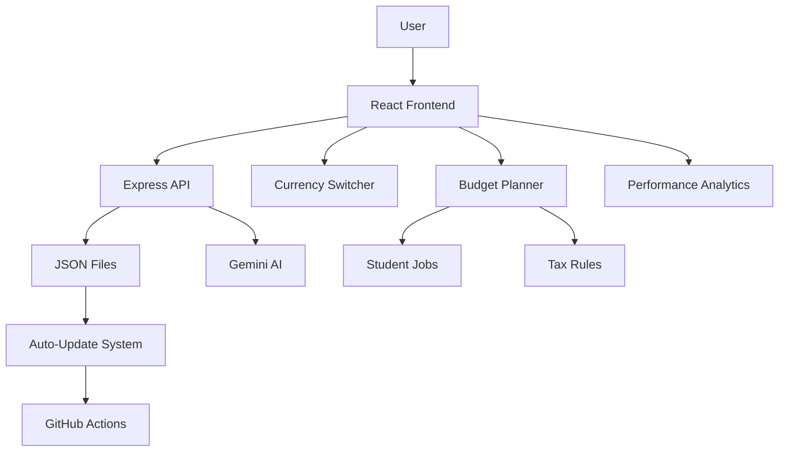

# 📖 ScholarPath – Complete User & Developer Guide

## 🎯 What is ScholarPath?

ScholarPath is an **AI-powered university and scholarship planning platform** designed to help students discover, track, and apply to universities and scholarships worldwide. It features a unique **Minecraft-inspired theme**, a comprehensive academic profile system, smart budget planning, and AI-powered advisors.

---

## 🚀 Key Features

### For Students
- **Academic Profile Builder** – Enter your curriculum (O/A Levels, IB, AP, etc.), subjects, and grades. GPA is automatically calculated.
- **Global University Database** – Search 10,000+ universities across 60+ countries with real tuition, acceptance rates, and admission links.
- **Global Scholarship Database** – Find 500+ scholarships with official application links, funding details, and deadlines.
- **Smart Budget Planner** – Estimate total costs (tuition, living, visa, flights) and see how scholarships and part-time work reduce your financial burden.
- **AI Advisors** – Get personalised recommendations for universities, scholarships, and financial planning.
- **Currency Switcher** – View all amounts in USD, EUR, GBP, BDT, CAD, AUD, INR, and more.
- **Performance Analytics** – Track your GPA trends, application progress, and financial readiness.
- **Quest Book** – Track your scholarship applications with checklists and status updates.
- **XP & Gamification** – Earn XP for completing tasks and unlock achievements.

### For Developers
- **Full-stack TypeScript** – React 19 + Node.js + Express
- **Data‑driven architecture** – All data stored in JSON files (no database needed for core data)
- **Auto‑update system** – GitHub Actions weekly updates for scholarships, universities, tax rules, and exchange rates.
- **Modular components** – Easy to extend and customise.

---

## 🛠️ Getting Started (User Guide)

### 1. Creating an Account
1. Go to the login page.
2. Enter a username and password, or click **"Spawn Instantly as Guest"**.
3. After logging in, you'll be guided through the **Academic Onboarding Wizard**.

### 2. Academic Onboarding Wizard
This is a step‑by‑step guide to build your academic profile:

| Step | What to do |
|------|------------|
| **Step 1: Curriculum** | Select your educational system(s) – Cambridge, IB, AP, CBSE, etc. |
| **Step 2: History** | Choose your academic path – O Levels only, A Levels only, both, or other. |
| **Step 3: Institution** | Enter your school/college/university name, country, and graduation year. |
| **Step 4: Subjects** | Select the subjects you took (automatically loaded from your curriculum). |
| **Step 5: Grades** | Enter your actual or predicted grades – GPA is automatically calculated! |

💡 **Tip:** If you only completed O Levels, just select "O Level only" – the wizard adapts to your path.

### 3. After Onboarding
Once your profile is complete, you can:

- **📊 View Performance Analytics** – See your GPA trends, subject improvements, and application progress.
- **🌍 Explore Universities** – Search by country, tuition range, GPA requirement, and more.
- **🎓 Find Scholarships** – Filter by funding type, degree level, country, deadline.
- **💰 Use the Budget Planner** – Estimate total study costs and see how scholarships and part‑time work help.
- **🤖 Ask the AI Advisors** – Get personalised recommendations for universities, scholarships, and finances.

---

## 🔧 Developer Guide

### Project Structure

```
rafie-kun.scolarship-app/
├── public/
│   └── data/                    # All JSON data files
│       ├── universities.json    # 10,000+ universities worldwide
│       ├── scholarships.json    # 500+ scholarships
│       ├── cost_of_living.json  # Country‑level cost data
│       ├── student_jobs.json    # Part‑time job data per country
│       ├── tax_rules.json       # Tax rules per country
│       └── exchange_rates.json  # Currency exchange rates
├── src/
│   ├── components/              # React components
│   │   ├── OnboardingWizard/    # Step‑by‑step academic setup
│   │   ├── CurrencySwitcher.tsx # Global currency selector
│   │   ├── BudgetPlanner.tsx    # Minecraft‑themed budget tool
│   │   ├── PerformanceAnalyticsView.tsx  # Real‑data charts
│   │   └── ...
│   ├── context/                 # React context providers
│   │   ├── AcademicProfileContext.tsx  # Academic data state
│   │   └── AuthContext.tsx      # Authentication state
│   ├── utils/
│   │   ├── calculations.ts      # GPA and competitiveness calculations
│   │   └── currencyConverter.ts # Currency conversion logic
│   └── index.css                # Global styles (Minecraft theme)
├── routes/
│   ├── academic.ts              # API endpoints for academic profiles
│   ├── ai.ts                    # AI advisor endpoints
│   └── analytics.ts             # Performance analytics endpoints
├── scripts/
│   ├── updateData.js            # Auto‑update merge script
│   └── updateExchangeRates.js   # Exchange rate fetcher
├── .github/workflows/
│   └── auto-update.yml          # Weekly auto‑update workflow
├── server.ts                    # Express server
├── vercel.json                  # Vercel deployment configuration
└── package.json                 # Dependencies and scripts
```

### Data Files – Overview

| File | Description | Auto‑Updated |
|------|-------------|--------------|
| `universities.json` | 10,000+ universities with tuition, ranking, acceptance rates, website, application portal | ✅ Weekly |
| `scholarships.json` | 500+ scholarships with funding, deadlines, eligibility, application links | ✅ Weekly |
| `cost_of_living.json` | Monthly costs: rent, food, transport, insurance, utilities by country | ✅ Weekly |
| `student_jobs.json` | Part‑time job data: wages, legal hours, common jobs by country | ✅ Weekly |
| `tax_rules.json` | Tax‑free allowance, tax brackets, social contributions by country | ✅ Weekly |
| `exchange_rates.json` | Currency conversion rates (USD base) | ✅ Daily |

### Auto‑Update System

The system runs **every Sunday at midnight** via GitHub Actions:

1. **Fetches** new data from official sources (government portals, RSS feeds, APIs).
2. **Merges** new entries with existing data.
3. **Preserves** any entry with `"userVerified": true` (never overwritten).
4. **Adds/updates** `"lastVerified"` timestamps.
5. **Commits** changes back to the repository.

**Manual trigger:** Go to GitHub → Actions → Auto-Update → Run workflow.

### Currency Switcher – How It Works

The currency switcher converts **all** displayed amounts across the app:

```tsx
// Example usage in a component
import { useCurrency } from '../context/CurrencyContext';

function ScholarshipCard({ scholarship }) {
  const { currency, convert } = useCurrency();
  const amount = convert(scholarship.livingStipend, 'USD');
  return <div>{amount} {currency.symbol}</div>;
}
```

**Supported currencies:** USD, EUR, GBP, BDT, CAD, AUD, INR, JPY, CHF, SGD, MYR, NZD, ZAR, BRL, MXN.

### GPA Calculation – Reuse the Existing Logic

The `utils/calculations.ts` file handles all GPA conversions:

```ts
// Example: Convert Cambridge A Level grade to GPA
function convertAlevelToGPA(grade: string): number {
  const map = { 'A*': 4.0, 'A': 3.7, 'B': 3.0, 'C': 2.3, 'D': 2.0, 'E': 1.0, 'U': 0.0 };
  return map[grade] || 0;
}
```

**All onboarding components use this existing logic** – do not duplicate it.

---

## 🧪 Testing Instructions

### Test 1: Academic Onboarding Wizard
1. Create a new account.
2. Complete the wizard with **O Level only** path.
3. Verify that **only O Level subjects** are shown.
4. Enter grades and verify GPA is calculated correctly.

### Test 2: Currency Switcher
1. Log in.
2. Change currency from USD to EUR.
3. Verify that tuition, scholarships, and budget numbers update instantly.
4. Refresh the page – your preference should persist.

### Test 3: Budget Planner
1. Complete your academic profile.
2. Go to Budget Planner.
3. Select a country and university.
4. Verify that all costs auto‑calculate (tuition, rent, food, etc.).
5. Toggle "Show Part‑Time Income" – net cost should update.

### Test 4: Performance Analytics
1. Without academic data, you should see an empty state.
2. After completing onboarding, GPA trends and subject improvements should appear.

### Test 5: Auto‑Update System
1. Run `node scripts/updateData.js` manually.
2. Check that new universities/scholarships are merged (not overwritten).
3. Verify `userVerified: true` entries are preserved.

---

## 🔧 Common Troubleshooting

| Issue | Solution |
|-------|----------|
| **XP bar not updating** | Check that `dispatchProfileUpdate(updatedProfile)` is called after rewards. |
| **"WEBSITE" button not working** | Ensure the scholarship/university has a valid `website` or `applicationUrl` (not a placeholder). |
| **Currency not converting** | Clear `localStorage` and refresh – the switcher will reset. |
| **GPA not calculating** | Verify you entered grades in the correct format for your curriculum. |
| **Auto‑update script fails** | Check network connectivity to data sources. Run with `--verbose` flag. |

---

## 🏛️ Architecture Summary



### Data Flow
1. **User enters academic data** → stored in `AcademicProfileContext`.
2. **GPA calculations** → `utils/calculations.ts` computes GPA, competitiveness.
3. **Budget Planner** → reads academic profile, selected country/uni, student jobs, tax rules, cost of living.
4. **Currency Switcher** → converts all amounts using exchange rates.
5. **AI Advisors** → use academic profile, budget, and preferences to give recommendations.

---

## 📦 Dependencies

| Package | Purpose |
|---------|---------|
| `react` / `react-dom` | UI framework |
| `express` | API server |
| `@google/genai` | Gemini AI integration |
| `better-sqlite3` | Local session storage (user data) |
| `framer-motion` | Animations |
| `recharts` | Performance analytics charts |
| `lucide-react` | Icons |

---

## 🤝 Contributing

1. Fork the repository.
2. Create a new branch for your feature/fix.
3. Follow the existing code style (TypeScript, ESLint).
4. Test your changes locally (`npm run dev`).
5. Submit a pull request with a clear description.

**Important:** When adding new data, always **merge** – never overwrite existing JSON files.

---

## 📄 License

MIT – Free to use, modify, and distribute.

---

**Built for students worldwide. 🎓🚀**
